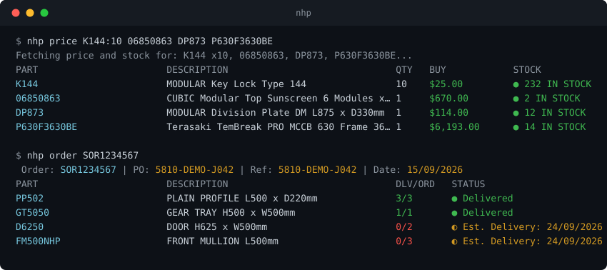

# nhp-cli

A CLI and library for the NHP New Zealand trade portal (`nhpnz.co.nz`):
product search, pricing and stock, order/invoice history, and cart
management from the terminal.



> [!NOTE]
> Configured for NHP New Zealand. The Australian portal (`nhp.com.au`) runs
> the same platform and should work with minor domain tweaks.

## Install

Requires [Deno](https://deno.com/) 2.x and an NHP portal login.

```bash
git clone https://github.com/Bedz01/nhp-cli.git
cd nhp-cli
deno install -g -A -f -n nhp nhp_cli.js
```

That makes `nhp` available from any directory (`deno run -A nhp_cli.js` works
too). Re-run the install command after pulling changes.

## Setup

```
nhp login
```

Asks for your portal username and password (not echoed), logs in, and
remembers both - later commands, and the re-login when the portal's 48-hour
session expires, happen silently. `nhp login --reset` switches accounts;
`nhp logout` forgets everything.

State lives in a per-user directory, never in the checkout:

| Platform | Directory |
| --- | --- |
| Windows | `%APPDATA%\nhp` |
| Linux / macOS | `$XDG_CONFIG_HOME/nhp`, else `~/.config/nhp` |
| Override | `NHP_CONFIG_DIR` |

```
config.json       { "sellMarginMultiplier": 1.25 }   optional; enables the SELL column
credentials.json  saved by `nhp login`
cookies.json      the portal session
```

On Windows the password is DPAPI-encrypted (current-user scope, so the file
is useless off-machine); elsewhere the file is plain text with mode `600`.
For scripts and CI, `NHP_USERNAME`/`NHP_PASSWORD` (and optionally
`NHP_SELL_MARGIN`, `NHP_CONFIG_DIR`) override the stored files and never
prompt - with `--json`, `--tsv`, or no terminal, a missing login is an error
rather than a prompt, so stdout stays clean.

Upgrading from 1.3 or earlier: run `nhp login` once and the old
module-relative `credentials.json`/`cookies.json` migrate to the state
directory.

## Commands

Run `nhp help` for the full reference with flags.

**Products & pricing**

- `nhp search <query>` - product search.
- `nhp price <part>[:qty]...` - price and stock, one ledger line per part.
  Quantities go on the part (`K144:2 06850863:10`); a bare number is always
  a part number, and `--qty <n>` sets the default. Unknown parts keep their
  line with the portal's reason, so rows always match what you asked for.
- `nhp csv <file>` - the same for a CSV of `partNumber[,qty]` rows (single
  column works, header rows are skipped).

**Orders & invoices**

- `nhp orders [page]` - order history ledger (`ORDER PO STATUS DATE`), 20
  per page. Filters: `--dateFrom`/`--dateTo` (yyyy-mm-dd) plus
  `--purchaseNumber`/`--documentNumber`/`--orderNumber`/`--customerReference`,
  which all feed the portal's single free-text search box.
- `nhp invoices [page]` - invoice history; `--brief` gives the ledger
  (`INVOICE ORDER PO DATE` - the order column links each invoice to its
  sales order).
- `nhp order <id...>` - line items with delivered/ordered quantities and
  delivery estimates, e.g. `nhp order SOR1314816`. Several ids print one
  ledger each; a failing id is reported on stderr without sinking the rest.
- `nhp invoice <id>` - line items for an invoice, e.g. `SIN02755715`.
- `nhp po <query>` - find orders by PO number; a single match auto-expands
  like `nhp order`.

**Cart**

- `nhp cart add <part> [qty]` - add an item. The second argument is a
  quantity only when it looks like one (1-9999, no leading zero); use
  `part:qty` for anything else, including bulk adds:
  `nhp cart add K144:2 06850863:10`. Rejected parts are reported with the
  portal's reason.
- `nhp cart list` / `remove <part|line#>` / `update <part|line#> <qty>` /
  `clear` - inspect and edit the cart. Part numbers win over line numbers
  when both readings are possible.
- `nhp cart upload <file>` - add a CSV of parts (same format as `nhp csv`).

There is deliberately no checkout: nothing in this tool can place an order.

**Output modes**, on every command where they make sense:

- Default: a compact ledger; `--full` for the record view (headers,
  addresses, totals; the default for `invoices`/`invoice`, which take
  `--brief` for the ledger).
- `--tsv`: spreadsheet export (below).
- `--json`: the raw API response on stdout, everything else on stderr.

Failed operations exit non-zero, so the CLI is safe to script against.

## Spreadsheet export (`--tsv`)

`price`, `csv`, `orders`, `order`, `invoices`, `invoice` and `po` take
`--tsv`: one header row, one tab-separated row per record (per line item for
`order`/`invoice`, parent fields repeated so the result is a flat table).
Plain text, no colour or truncation, money and quantities as bare numbers -
it pastes straight into columns:

```powershell
nhp order SOR1000001 SOR1000002 --tsv | Set-Clipboard        # paste into Excel/Sheets
nhp invoices --dateFrom 2026-07-01 --tsv | Set-Clipboard
nhp price K144 06850863 --tsv | ConvertFrom-Csv -Delimiter "`t"   # PowerShell objects
```

Columns (blank where NHP has no such value):

```
price/csv   PART  DESCRIPTION  QTY  BUY  SELL  LIST  CURRENCY  STOCK  STOCK STATUS  ERROR
orders      ORDER  PO  STATUS  DATE  TOTAL
order       ORDER  PO  ORDER STATUS  DATE  LINE  PART  DESCRIPTION  DELIVERED  ORDERED  LINE STATUS  UNIT PRICE  TOTAL
invoices    INVOICE  PO  REF  STATUS  DATE  TOTAL  OUTSTANDING
invoice     INVOICE  PO  REF  DATE  LINE  PART  DESCRIPTION  QTY  UNIT PRICE  TOTAL
```

`STOCK` is the NZ on-hand quantity; `LIST` the undiscounted price break;
`SELL` is filled only when `sellMarginMultiplier` is configured. Dates are
`dd/mm/yyyy` everywhere. Failures still go to stderr with a non-zero exit
and contribute no rows. `--tsv` wins over `--full`/`--brief`; `--json` wins
over both.

## Portal quirks

The portal was rebuilt in September 2026 (Next.js over a REST API at
`/api/v1/`); these are the undocumented behaviours of the new backend:

- **Login is Microsoft Entra native auth, proxied through the portal.** The
  flow is preflight → initiate → challenge → token against
  `/api/v1/auth/oauth2/v2.0/*`; the token response sets the `__Host-sid`
  session cookie (48 h), and that cookie alone authenticates every data
  call - there are no anti-forgery tokens and the OAuth tokens themselves
  are never needed. If the challenge step asks for anything but `password`
  (e.g. an emailed code), the CLI cannot answer it and says so.
- **The order-detail endpoint rejects the order list's own ids.**
  `GET /orders/{id}` wants the bare sales order number (`SOR1314816`); the
  composite `id` the list returns (`NZ-20198-SOR1314816`) gets a 404. The
  client strips the prefix (`normalizeOrderId`). Invoices are the same
  story: `GET /invoices/{id}/line-items` wants the invoice number
  (`SIN02755715`), not the GUID `id` field from the invoice list.
- **Line items carry two prices.** `unitPrice` is the list price;
  `netPrice` is the account's actual price, and `lineAmount` is
  `netPrice × qty`. Everything printed as a price uses `netPrice`.
- **Invoice `status` is a bare code** (every invoice so far says `"3"`); the
  portal itself does not display it anywhere, so this tool doesn't either.
  The invoice ledger shows the related order number in that column instead,
  the `--tsv` STATUS cell stays blank, and `--json` still carries the raw
  code.
- **Batch endpoints cap at 20 ids per request** (`products/batch`,
  `availability`, `cart/lineitems/batch`); the client chunks transparently.
- **There is no clear-cart endpoint.** The site's own "Remove all" deletes
  lines one at a time; `cart clear` does the same.
- **Dates are ISO timestamps**, except line statuses, which embed unpadded
  `d/M/yyyy` inside text like `Est. Delivery: 22/09/2026`. Every printed
  date goes through `formatDate`, which normalises both to `dd/mm/yyyy`.
- **Line statuses contain literal HTML.** A delivered line's `eta` is
  `Delivered<br/>` - the API serves display markup, not data. Statuses go
  through `cleanStatus`, which strips tags and collapses whitespace.

## Library usage

`mod.js` re-exports the client for programmatic use. By default it resolves
credentials the way the CLI does (env vars, then the stored file) and keeps
the session in the same state directory.

```javascript
import { NHPClient } from "./mod.js";

const client = new NHPClient({
  // All optional:
  cookiePath: "./data/custom_cookies.json",
  credentials: { username: "you@example.com", password: "..." },
  timeoutMs: 30000,
  silent: true,
});
await client.ensureLogin();
```

`credentials` may also be an async provider, called only when a login is
actually needed; `onLogin(creds)` fires after each successful login. Every
request carries a timeout and re-authenticates once automatically if the
session has expired. The `store` export has the credential plumbing
(`resolveCredentials`, `saveCredentials`, `dpapiProtect`/`dpapiUnprotect`,
`configDir`).

### Methods

**`searchProducts(query)`** - product search; results in
`results.widgets[0].content`.

**`getPriceAndStock(items)`** - takes `[{ itemId, qty }]`, fetches product
records and availability in parallel, and returns one entry per requested
item. Unknown parts get `error` set instead of throwing, so results always
line up with the request. `getProducts(itemIds)` and
`getAvailability(itemIds)` expose the two halves individually.

```javascript
const pricing = await client.getPriceAndStock([{ itemId: "K144", qty: 5 }]);
for (const entry of pricing.products) {
  if (entry.error) continue; // the portal's reason for an unknown part
  const brk = entry.product.priceBreaks[0];
  const nz = entry.availability.stockQuantities.find((s) => s.type === "national");
  console.log(`Buy: ${brk.discountedPrice}  List: ${brk.price}  NZ stock: ${nz?.quantity ?? 0}`);
}
```

**`getOrders(pageSize, page, options)`** / **`getInvoices(...)`** /
**`getBackorders(...)`** - history listings, 1-based pages, returning
`{ items, meta }` (`meta` carries `page`, `totalPages`, `totalCount`).
`options` takes `dateFrom`/`dateTo` (yyyy-mm-dd) and a free-text `search`
(`purchaseNumber` etc. are accepted as aliases for it).

```javascript
const orders = await client.getOrders(20, 1, { purchaseNumber: "PO-12345" });
```

**`getOrderDetails(orderId)`** - order header plus `lineItems` with shipping
status and delivery estimates, for a sales order number (composite list ids
are normalised).

**`getInvoiceDetails(invoiceId)`** - `{ header, lineItems }` for an invoice
number.

**Cart** - mutations respond with the updated cart state:

```javascript
await client.addToCart("115797", 2);
const cart = await client.getCart(); // { cart, lineItems, miniCart, messages }
await client.updateCartLineQuantity(cart.lineItems[0], 5);
await client.removeCartLine(cart.lineItems[0].id);
await client.clearCart();

const result = await client.uploadCartCsv("./bulk_order.csv");
// -> { success, requested: string[], missing: string[], Warnings: string[] }
```

## Development

```bash
deno task check   # lint + type-check + tests
deno task test    # offline unit tests only
```

Offline unit tests live in `tests/` and run in CI on every push.
